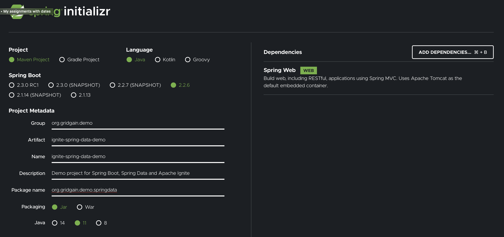

# Getting Started With Apache Ignite, Spring Boot and Spring Data Demo

Step-by-step plan:
* Initialize the project with Spring Initializer: https://start.spring.io
* Add Ignite dependencies (core, spring data, spring boot extension)
* Download Ignite 2.8, start 2 nodes and load the Cities database with SQLLine.
* Create Spring Data Repositories for Citites and Countries.
* Define some Spring methods to query data.
* Query with Ignite syntax (at least for joins).
* Update and delete data with Spring Data repositories.
* REST processors of spring boot (https://medium.com/swlh/spring-cache-with-apache-ignite-def103cae35)
Note, the readers have to build the project from scratch while this github repo is a complete solution for reference and has a fewer instructions (like start the cluster and run this-that).

## Start Ignite Cluster and Create Sample Database

* Download Ignite 2.8.0
* Start 2-nodes cluster.
* Edit the world.sql file:
- Set Country table's VALUE_TYPE to `VALUE_TYPE=org.gridgain.demo.springdata.model.Country"`
- Update City table `KEY_TYPE=org.gridgain.demo.springdata.model.CityKey` and `VALUE_TYPE=org.gridgain.demo.springdata.model.City`
* Create the database with SQLLine.
`./sqlline.sh -u jdbc:ignite:thin://127.0.0.1/`
`!run ../examples/sql/world.sql`

## Creating Project With Spring

Init the project with parameters shown on the picture below (https://start.spring.io):

## Adding Ignite Artifacts With Maven

Insert all the Ignite specific Maven dependencies (check the content of this pom.xml).

Set H2 version to `<h2.version>1.4.197</h2.version>`

change Spring's port number - `server.port=9000`

## Create Models for Cities and Countries

Create Ignite specific domain objects as well as DTO (Data Transfer Objects).

## Create IgniteRepositories

Working with Countries repo:
* Create a method with query auto-generation that returns countries with population equal or exceeding a passed parameter: `http://localhost:9000/api/countries?population=120000000`

Working with Cities:
* Create an auto-generated method that returns cities with specific population: `http://localhost:9000/api/cities?population=8000000`
* Create a named method that joins tables and returns most populated cities: `http://localhost:9000/api/cities/mostPopulated?limit=10`
* Create a method that updates population using Spring data (note that we have to use the named query to find a city by id
because Ignite Spring Data integration doesn't introspect the fields of the keys):
`curl -X PUT -H 'Content-Type: application/json' -d '{"population":5000}' http://localhost:9000/api/cities/3507`

Say, that "UPDATE" or "DELETE" can be used with the named queries for the cases when you just need to update a record or
records and don't need to return the objects via the REST API.
